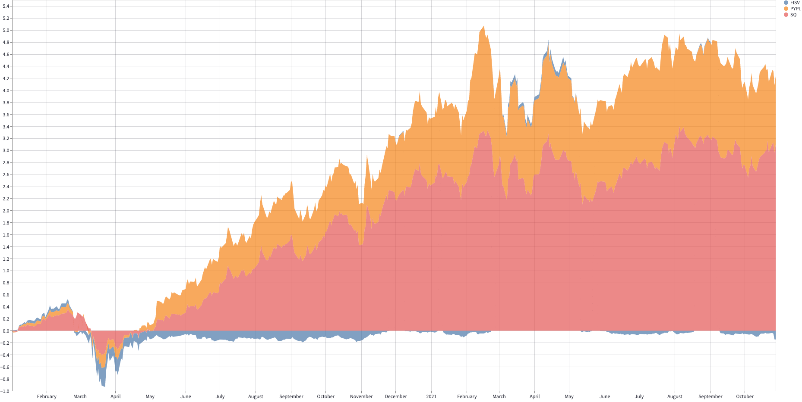

Stock Comparison Dashboard
===========================

 

Overview
---------
This is a simple streamlit web application that generates beautiful charts  
using yfinance and matplotlib. No HTML, CSS, or JS needed. The streamlit  
library will automatically build your python code into a web application, with some neat features. 

 

Features
-----------
1. compare multiple stocks
2. generate charts (price, returns, volume)

 

Run locally
-------------
1. install packages `pip3 install -r requirements.txt`
2. run app `streamlit run test.py`

 

 <i>Output Figure</i>

