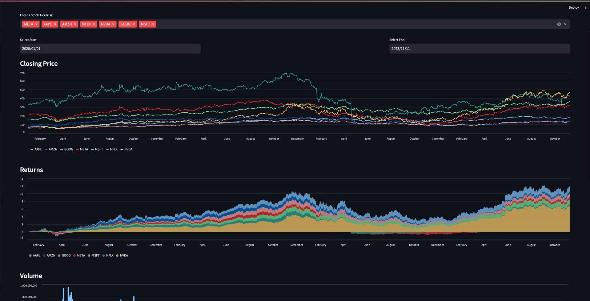
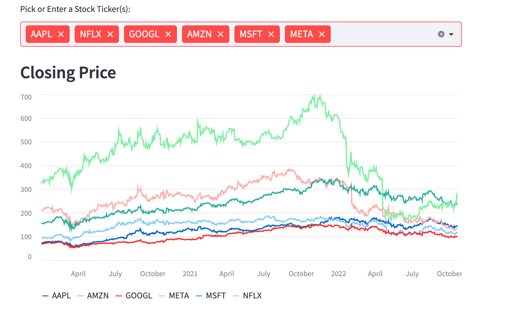
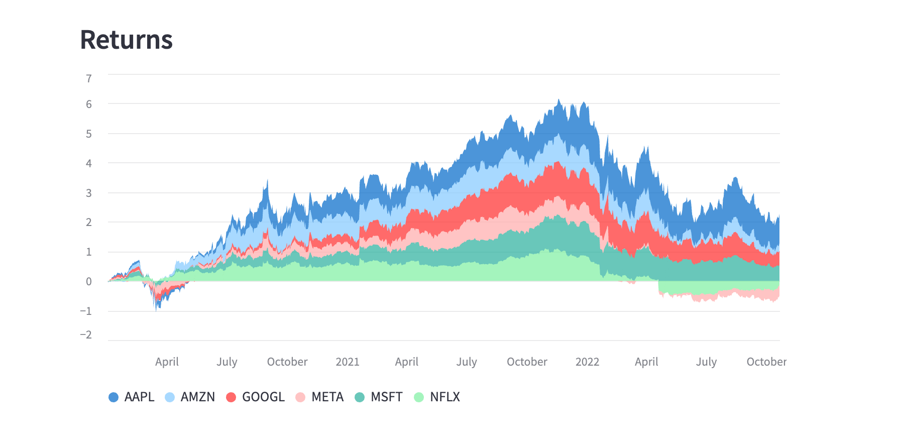
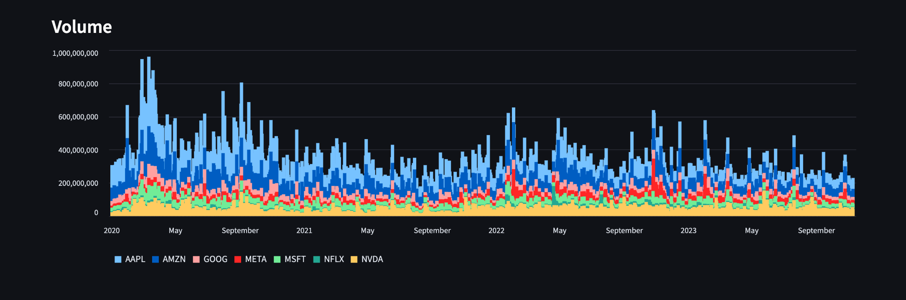

Stock Comparison Dashboard
===========================

 

 <i>Closing Price</i>

 

Overview
---------
This is a simple streamlit web application that generates beautiful charts  
using yfinance and matplotlib. No HTML, CSS, or JS needed. The streamlit  
library will automatically build your python code into a web application, with some neat features. 

 

Features
-----------
1. compare multiple stocks closing prices
2. stock returns
3. trading volume
4. Expand chart window and save chart image
5. 7825 tickers to choose from (some may not work based on the timeframe given)

 

Setup Config
-------------
1. Create python environment `python3 -m venv env`
2. install packages `pip3 install -r requirements.txt`
3. run app `streamlit run app.py`

 

 

 <i>Closing Price</i>

 

 <i>Returns</i>

 

 <i>Volume</i>

 

 

## App Update (10/22/2022)

added 7825 tickers of stocks, global stocks, etfs, and other various funds. If the tickers you have selected did not work, it means yahoo finance
does not have their data in their database.

 